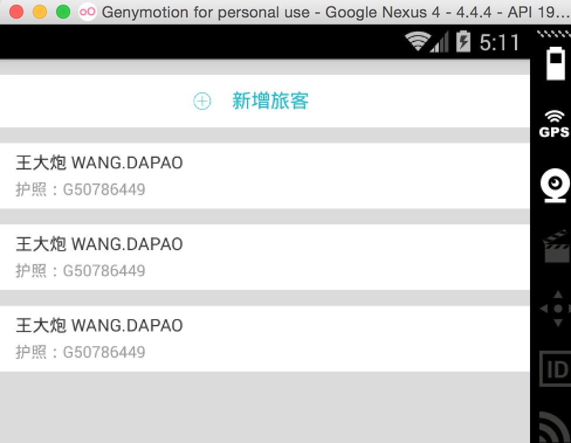
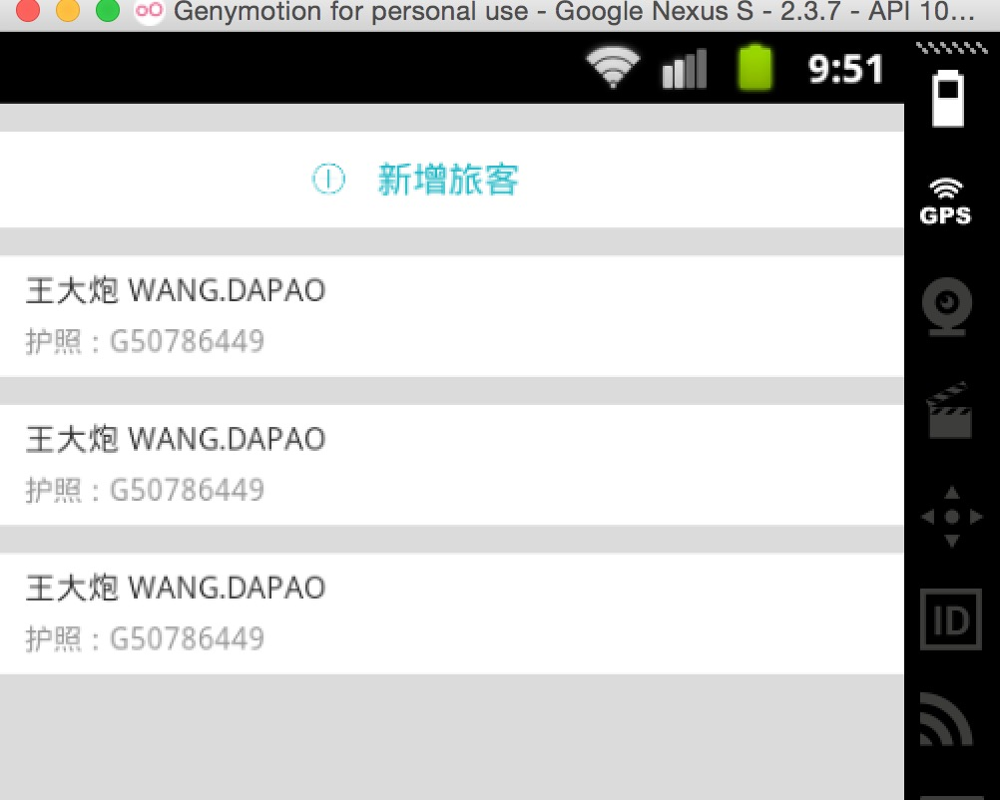

# AndroidAutoLayout
Android屏幕适配方案，直接填写设计图上的像素尺寸即可完成适配。

非常感谢 ： 吃土豆的人 的协作。

## 效果图

最大幅度解决适配问题，并且最大化方便开发者。

so,看下用法：


你没有看错，拿到设计稿，在布局文件里面直接填写对应的px即可，px:这里的px并非是Google不建议使用的px，在内部会进行转化处理。

看下不同分辨率下的效果：

768*1280,Andriod 4.4.4




480*800,Android 2.3.7




上述两个机器的分辨率差距相当大了，但是完美实现了适配，最为重要的是：

* 再也不用拿着设计稿去想这控件的宽高到底取多少dp
* 再也不用去为多个屏幕去写多个dimens
* 再也不用去计算百分比了（如果使用百分比控件完成适配）
* 再也不用去跟UI MM去解释什么是dp了

你所要做的就是抄抄设计稿上面的px，直接写入布局文件。

还有很多好处，比如上面的Item里面元素比较多，如果标识的比较全面，一个FrameLayout，里面的View填写各种marginLeft,marginTop就能完美实现，几乎不需要嵌套了。

## 用法

* Android Studio

将[autolayout](autolayout)引入

```xml
dependencies {
    compile project(':autolayout')
}
```

也可以直接

```
dependencies {
    compile 'com.zhy:autolayout:1.2.0'
}
```

### 第一步：

在你的项目的AndroidManifest中注明你的`设计稿`的尺寸。

```xml
<meta-data android:name="design_width" android:value="768">
</meta-data>
<meta-data android:name="design_height" android:value="1280">
</meta-data>
    
```

### 第二步：

让你的Activity继承自`AutoLayoutActivity`.


非常简单的两个步骤，你就可以开始愉快的编写布局了，详细可以参考sample。


## 其他用法

如果你不希望继承`AutoLayoutActivity`，可以在编写布局文件时，将

* LinearLayout -> AutoLinearLayout
* RelativeLayout -> AutoRelativeLayout
* FrameLayout -> AutoFrameLayout

这样也可以完成适配。


## 目前支持属性

* layout_width
* layout_height
* layout_margin(left,top,right,bottom)
* pading(left,top,right,bottom)
* textSize


## 注意事项

### 1、 指定设置的值参考宽度或者高度

由于该库的特点，布局文件中宽高上的1px是不相等的，于是如果需要宽高保持一致的情况，布局中使用属性：

 `app:layout_auto_basewidth="height"`，代表height上编写的像素值参考宽度。
 
 `app:layout_auto_baseheight="width"`，代表width上编写的像素值参考高度。

如果需要指定多个值参考宽度即：

`app:layout_auto_basewidth="height|padding"`

用|隔开，类似gravity的用法，取值为：

* width,height
* margin,marginLeft,marginTop,marginRight,marginBottom
* padding,paddingLeft,paddingTop,paddingRight,paddingBottom
* textSize.

### 2、将状态栏区域作为内容区域

如果某个Activity需要将状态栏区域作为实际的内容区域时，那么可用高度会变大，你所要做的只有一件事：让这个Activity实现`UseStatusBar`接口(仅仅作为标识左右，不需要实现任何方法)，当然你肯定要自己开启`windowTranslucentStatus`或者设置`FLAG_TRANSLUCENT_STATUS`。

注意：仅仅是改变状态栏颜色，并不需要实现此接口，因为并没有实际上增加可用高度。


### 3、TextView的高度问题

设计稿一般只会标识一个字体的大小，比如你设置textSize="20px"，实际上TextView所占据的高度肯定大于20px，字的上下都会有一定的建议，所以一定要灵活去写字体的高度，比如对于text上下的margin可以选择尽可能小一点。或者选择别的约束条件去定位（比如上例，选择了marginBottom）


## 其他信息

作者信息：

* [hongyangAndroid](https://github.com/hongyangAndroid)
* 吃土豆的人


灵感来自：

* [android-percent-support-lib-sample](https://github.com/JulienGenoud/android-percent-support-lib-sample)
* [android-percent-support-extend](https://github.com/hongyangAndroid/android-percent-support-extend)
* [Android 屏幕适配方案](http://blog.csdn.net/lmj623565791/article/details/45460089)


