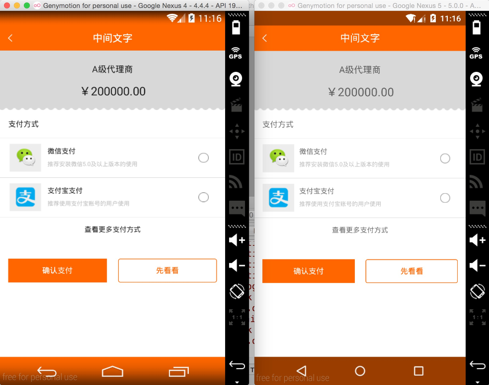

# AndroidAutoLayout
Android屏幕适配方案，直接填写设计图上的像素尺寸即可完成适配。

非常感谢 ： 吃土豆的人 的协作。

## 效果图

最大幅度解决适配问题，并且最大化方便开发者。

so,看下用法：


你没有看错，拿到设计稿，在布局文件里面直接填写对应的px即可，px:这里的px并非是Google不建议使用的px，在内部会进行转化处理。

ok，拿一些实际项目的页面，看下不同分辨率下的效果：

左为：768 * 1280 ; 右为：1080 * 1920





上述两个机器的分辨率差距挺大了，但是完美实现了适配，最为重要的是：

* 再也不用拿着设计稿去想这控件的宽高到底取多少dp
* 再也不用去为多个屏幕去写多个dimens
* 再也不用去计算百分比了（如果使用百分比控件完成适配）
* 再也不用去跟UI MM去解释什么是dp了

你所要做的就是抄抄设计稿上面的px，直接写入布局文件。

还有很多好处，比如上面的Item里面元素比较多，如果标识的比较全面，一个FrameLayout，里面的View填写各种marginLeft,marginTop就能完美实现，几乎不需要嵌套了。

## 引入

* Android Studio

将[autolayout](autolayout)引入

```xml
dependencies {
    compile project(':autolayout')
}
```

也可以直接

```
dependencies {
    compile 'com.zhy:autolayout:1.3.6'
}
```

* Eclipse

下载[AutoLayoutDemoForEclipse.zip](AutoLayoutDemoForEclipse.zip)，导入到eclipse中即可。

## 用法

### 第一步：

在你的项目的AndroidManifest中注明你的`设计稿`的尺寸。

```xml
<meta-data android:name="design_width" android:value="768">
</meta-data>
<meta-data android:name="design_height" android:value="1280">
</meta-data>
    
```

### 第二步：

让你的Activity继承自`AutoLayoutActivity`.


非常简单的两个步骤，你就可以开始愉快的编写布局了，详细可以参考sample。


## 其他用法

如果你不希望继承`AutoLayoutActivity`，可以在编写布局文件时，将

* LinearLayout -> AutoLinearLayout
* RelativeLayout -> AutoRelativeLayout
* FrameLayout -> AutoFrameLayout

这样也可以完成适配。

## 目前支持属性

* layout_width
* layout_height
* layout_margin(left,top,right,bottom)
* pading(left,top,right,bottom)
* textSize
* maxWidth, minWidth, maxHeight, minHeight


## 配置

默认使用的高度是设备的可用高度，也就是不包括状态栏和底部的操作栏的，如果你希望拿设备的物理高度进行百分比化：

可以在Application的onCreate方法中进行设置:

```java
public class UseDeviceSizeApplication extends Application
{
    @Override
    public void onCreate()
    {
        super.onCreate();
        AutoLayoutConifg.getInstance().useDeviceSize();
    }
}

```

## 预览

大家都知道，写布局文件的时候，不能实时的去预览效果，那么体验真的是非常的不好，也在很大程度上降低开发效率，所以下面教大家如何用好，用对PreView（针对该库）。

首先，你要记得你设计稿的尺寸，比如 `768 * 1280`

然后在你的PreView面板，选择于设计图分辨率一致的设备：


然后你就可以看到`最为精确的`预览了：


两个注意事项：

1. 你们UI给的设计图的尺寸并非是主流的设计图，该尺寸没找到，你可以自己去新建一个设备。
2. 不要在PreView中去查看所有分辨率下的显示，是看不出来适配效果的，因为有些计算是动态的。

## 扩展

对于其他继承系统的FrameLayout、LinearLayout、RelativeLayout的控件，比如`CardView`，如果希望再其内部直接支持"px"百分比化，可以自己扩展，扩展方式为下面的代码，也可参考[issue#21](https://github.com/hongyangAndroid/AndroidAutoLayout/issues/21)：

```
package com.zhy.sample.view;

import android.content.Context;
import android.support.v7.widget.CardView;
import android.util.AttributeSet;

import com.zhy.autolayout.AutoFrameLayout;
import com.zhy.autolayout.utils.AutoLayoutHelper;

/**
 * Created by zhy on 15/12/8.
 */
public class AutoCardView extends CardView
{
    private final AutoLayoutHelper mHelper = new AutoLayoutHelper(this);

    public AutoCardView(Context context)
    {
        super(context);
    }

    public AutoCardView(Context context, AttributeSet attrs)
    {
        super(context, attrs);
    }

    public AutoCardView(Context context, AttributeSet attrs, int defStyleAttr)
    {
        super(context, attrs, defStyleAttr);
    }

    @Override
    public AutoFrameLayout.LayoutParams generateLayoutParams(AttributeSet attrs)
    {
        return new AutoFrameLayout.LayoutParams(getContext(), attrs);
    }

    @Override
    protected void onMeasure(int widthMeasureSpec, int heightMeasureSpec)
    {
        if (!isInEditMode())
        {
            mHelper.adjustChildren();
        }
        super.onMeasure(widthMeasureSpec, heightMeasureSpec);
    }


}
```


## 注意事项

### ListView、RecyclerView类的Item的适配

**sample中包含ListView、RecyclerView例子，具体查看sample**

* 对于ListView

对于ListView这类控件的item，默认根局部写“px”进行适配是无效的，因为外层非AutoXXXLayout，而是ListView。但是，不用怕，一行代码就可以支持了：

```java
@Override
public View getView(int position, View convertView, ViewGroup parent)
{
    ViewHolder holder = null;
    if (convertView == null)
    {
        holder = new ViewHolder();
        convertView = LayoutInflater.from(mContext).inflate(R.layout.list_item, parent, false);
        convertView.setTag(holder);
        //对于listview，注意添加这一行，即可在item上使用高度
        AutoUtils.autoSize(convertView);
    } else
    {
        holder = (ViewHolder) convertView.getTag();
    }

    return convertView;
}
```

注意` AutoUtils.autoSize(convertView);`这行代码的位置即可。demo中也有相关实例。


* 对于RecyclerView

```java
public ViewHolder(View itemView)
{
      super(itemView);
      AutoUtils.autoSize(itemView);
}

//...
@Override
public ViewHolder onCreateViewHolder(ViewGroup parent, int viewType)
{
     View convertView = LayoutInflater.from(mContext).inflate(R.layout.recyclerview_item, parent, false);
     return new ViewHolder(convertView);
}

```

一定要记得`LayoutInflater.from(mContext).inflate`使用三个参数的方法！


### 指定设置的值参考宽度或者高度

由于该库的特点，布局文件中宽高上的1px是不相等的，于是如果需要宽高保持一致的情况，布局中使用属性：

 `app:layout_auto_basewidth="height"`，代表height上编写的像素值参考宽度。
 
 `app:layout_auto_baseheight="width"`，代表width上编写的像素值参考高度。

如果需要指定多个值参考宽度即：

`app:layout_auto_basewidth="height|padding"`

用|隔开，类似gravity的用法，取值为：

* width,height
* margin,marginLeft,marginTop,marginRight,marginBottom
* padding,paddingLeft,paddingTop,paddingRight,paddingBottom
* textSize.

### TextView的高度问题

设计稿一般只会标识一个字体的大小，比如你设置textSize="20px"，实际上TextView所占据的高度肯定大于20px，字的上下都会有一定的建议，所以一定要灵活去写字体的高度，比如对于text上下的margin可以选择尽可能小一点。或者选择别的约束条件去定位（比如上例，选择了marginBottom）

##TODO

* 增加单个Activity横屏布局的支持（设计图必须是横屏的）
* 完善demo(复杂的，简单的，ListView的各种)

## 其他信息

作者信息：

* [hongyangAndroid](https://github.com/hongyangAndroid)
* 吃土豆的人


灵感来自：

* [android-percent-support-lib-sample](https://github.com/JulienGenoud/android-percent-support-lib-sample)
* [android-percent-support-extend](https://github.com/hongyangAndroid/android-percent-support-extend)
* [Android 屏幕适配方案](http://blog.csdn.net/lmj623565791/article/details/45460089)


